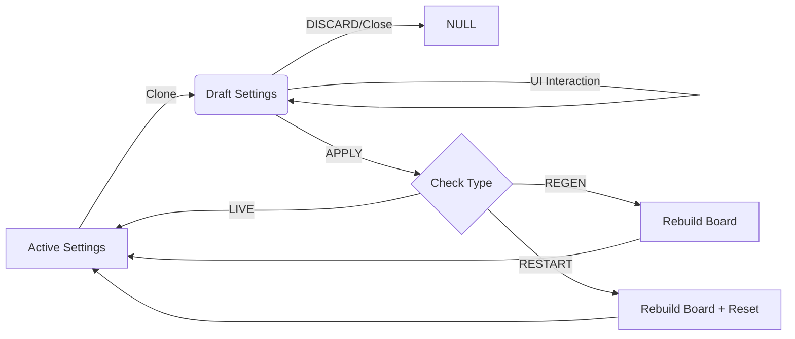

────────────────────────────────────────────────────────────────────────────────
# SPEEDGRID SETTINGS LIFECYCLE

## 1. FLOW ARCHITECTURE
SpeedGrid uses a **Transactional Settings Model** to prevent unintended gameplay interruptions.

## 2. SETTINGS CATEGORIZATION

| Category | Impact | Settings |
| :--- | :--- | :--- |
| **LIVE** | Immediate update; No gameplay reset. | `multiTouchMode`, `devMode`, `diagnosticMode`, `showGravityVisuals`, `tuning`. |
| **REGEN** | Re-solves board; Preserves score. | `targetSource`, `multiplesConfig`, `rangeConfig`, `specificConfig`, `operationMode`, `numberPool`. |
| **RESTART**| Full board/dimension reset. | `activeProfileId`, `gridSize`. |

## 3. DIRTY STATE LOGIC
- **Drafting**: Occurs while the Controls modal is open.
- **Comparison**: `JSON.stringify(draftSettings) !== JSON.stringify(activeSettings)`.
- **Commit**: The **APPLY** button is only enabled when a change is detected.

## 4. MUTATION RESTRICTIONS
- **Rule 1**: NEVER mutate `state.settings` directly from a UI component.
- **Rule 2**: Reducer logic must always use `state.settings` for gameplay calculations.
- **Rule 3**: `generateInitialState` must accept `initialSettings` to preserve user overrides during board regeneration.

## 5. REGEN SAFETY
When a **REGEN** setting is committed:
1. Pointers and current paths are cleared to avoid coordinate mismatches.
2. The board is re-randomized using the new constraints.
3. The Target sequence is recalculated.
4. Existing score and multipliers are preserved (unless categorical reset is flagged).
────────────────────────────────────────────────────────────────────────────────
